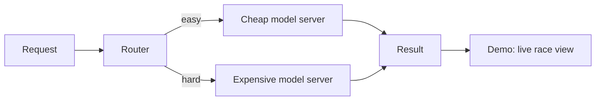

# LLM Inference Server — Technical Design Doc

2026-09-22

## Overview

**The problem:** running every request through the biggest, most accurate model is slow and expensive, but most requests are actually easy, you don't know which ones are hard until you look. Most inference servers also make requests wait in a strict line, so one slow request holds up everyone behind it even when there's spare capacity.

**What this builds:** llm-inference-server, a server that batches concurrent requests together instead of processing them one at a time, and routes each request to a small/cheap model or a larger/slower model based on estimated difficulty.

**Deliverable:** a working server, a live race-style demo comparing it against a naive baseline in real time, and a benchmark with real cost, latency, and throughput numbers.

## Goals and non-goals

**In scope for v1:**

- Load and run two model sizes: one small/cheap, one larger/slower
- Manual token-by-token decode loop with KV-cache reuse for both models (no `.generate()`)
- A batching scheduler that processes multiple requests per GPU step, per model tier
- A router that scores each incoming request for difficulty and picks a tier
- A generic text task (e.g. question answering or summarization) — the task itself is not the point, the serving/routing underneath it is
- A FastAPI endpoint for submitting a request and receiving the result
- A benchmark comparing "always route to the expensive model" vs. "routed" on cost, latency, and output quality
- A live, visual demo page that races the naive server against llm-inference-server in real time
- A Docker image and a small hosted demo

**Out of scope for v1 (possible later additions):**

- Multi-model registry, versioning, or more than two tiers
- Autoscaling across multiple GPUs or machines
- A full observability dashboard

## Architecture

The router scores each request (length, ambiguity signals) and picks a tier. Each model server runs its own batching scheduler underneath — multiple requests routed to the same tier are processed together as one batch, with KV-cache reuse across decode steps. The demo layer is a thin visualization on top: it runs the same requests through a naive one-at-a-time path and through llm-inference-server side by side, so the difference is visible, not just measured.

## Component details

### Model loading

- Two model sizes via Hugging Face `transformers` — e.g. a small model (GPT-2 / DistilGPT2 scale) for the cheap tier and a larger one (Qwen2.5-0.5B-Instruct or similar) for the expensive tier
- Both loaded once at startup and kept resident

### Router

- Deliberately simple — it's a decision, not a model of its own
- Scores each incoming request on a few cheap signals: length, presence of flagged/ambiguous keywords, detected language
- A basic rule (e.g. a weighted threshold) or a tiny classifier maps that score to "cheap" or "expensive"
- Logs its decision so it can be audited in the benchmark later

### Scheduler (per model tier)

- A fixed pool of decode "slots" (4–8 to start) for each tier
- Each step: run every active slot through that tier's model together as one batch, with padding and an attention mask so different-length prompts don't corrupt each other's output
- After each step: check for finished requests (EOS token or max length), evict them, and immediately pull the next waiting request into that freed slot
- Track each request's `past_key_values` (its KV-cache) across steps, keyed to its slot — never recompute earlier tokens

### API layer

- FastAPI with an `async` `/process` endpoint that takes a request and returns a result
- A request enters the router first, then the appropriate tier's queue; the response resolves once generation finishes
- A `force_tier` flag for testing, so the benchmark can force "always expensive" as a baseline against real routing

### Benchmarking harness

- An `asyncio`/`httpx` script that fires N concurrent requests (N = 1, 4, 8, 16) at both "routed" and "always expensive" modes
- Metrics: total time, tokens/sec throughput, p50/p99 latency, estimated compute cost (proxy: total tokens generated × tier's relative cost), and output quality (a simple proxy like output length/keyword overlap, or manual spot-check on a small labeled set)
- Output: charts comparing routed vs. always-expensive on cost, latency, and quality, saved alongside the raw numbers

### Demo

- A single page that fires the same batch of requests at both a naive one-at-a-time server and llm-inference-server, side by side, live
- Simple visual units (one per request) light up as each finishes — naive lights them one at a time, llm-inference-server lights groups together
- A running timer per side, ending in a final comparison: elapsed time and a computed speedup
- No login, no setup, no jargon on screen — someone should understand what's happening within a few seconds of watching it, before you say a word
- This reuses the exact request/response code from the benchmark harness — it's the same timing data, just animated instead of charted

## Known issues and risks

| Issue | Why it happens | Fix |
| --- | --- | --- |
| Padding tokens corrupt output | Batching different-length prompts needs padding; without an attention mask the model attends to the padding | Use a per-sequence attention mask; left-pad for causal-LM generation |
| KV-cache misaligned after eviction | Removing a finished request shifts tensor indices for everything after it | Track slot → request mapping explicitly; never rely on list order |
| `.generate()` hides the KV-cache from you | HuggingFace's built-in method manages `past_key_values` internally | Write the decode loop by hand, even though it's more code — this is the point of the project |
| Router misclassifies a hard request as easy | Cheap heuristics (length, keywords) are a rough proxy for real difficulty | Log every routing decision; spot-check misroutes in the benchmark and report the error rate honestly, don't hide it |
| "Cost saved" number is meaningless without a quality check | It's trivial to save cost by routing everything to the cheap model — that's not a win if quality tanks | Always report cost savings next to a quality metric, not alone |
| Benchmark numbers look flat or noisy | Testing on CPU, or with models too small to be compute-bound | Run the real benchmark on a rented GPU instance, not a local CPU |
| Works locally, breaks in Docker | Missing CUDA base image, or model weights not present at container start | Use an official PyTorch CUDA base image; download or mount weights explicitly |
| Requests hang or time out under load | No backpressure — the server accepts an unlimited queue | Cap queue size; return an explicit error when full instead of hanging |

## Deployment plan

- **Containerize** with Docker — a PyTorch CUDA base image for the GPU benchmark run; a CPU-only image is fine for the always-on demo, since that's about correctness, not speed
- **Benchmark run**: a rented GPU instance (RunPod, Lambda Labs, or Colab) — this is where the real throughput numbers come from
- **Always-on demo**: a small CPU instance (Fly.io, Railway, or a free-tier EC2 instance) so there's a live link to share, even though it won't show the full speedup live
- Both model tiers need to fit in memory together on the demo instance — pick sizes accordingly, or keep the expensive tier small enough to run alongside the cheap one on a single rented GPU

## Success criteria

- A working routed pipeline with real, reproducible benchmark numbers — not placeholders
- A chart showing routing cuts cost/compute vs. always-expensive, with quality reported alongside it, not hidden
- The live race demo runs and is understandable to someone with zero ML background, unprompted
- A live demo link
- A clean GitHub repo with a README that leads with the problem and the result
